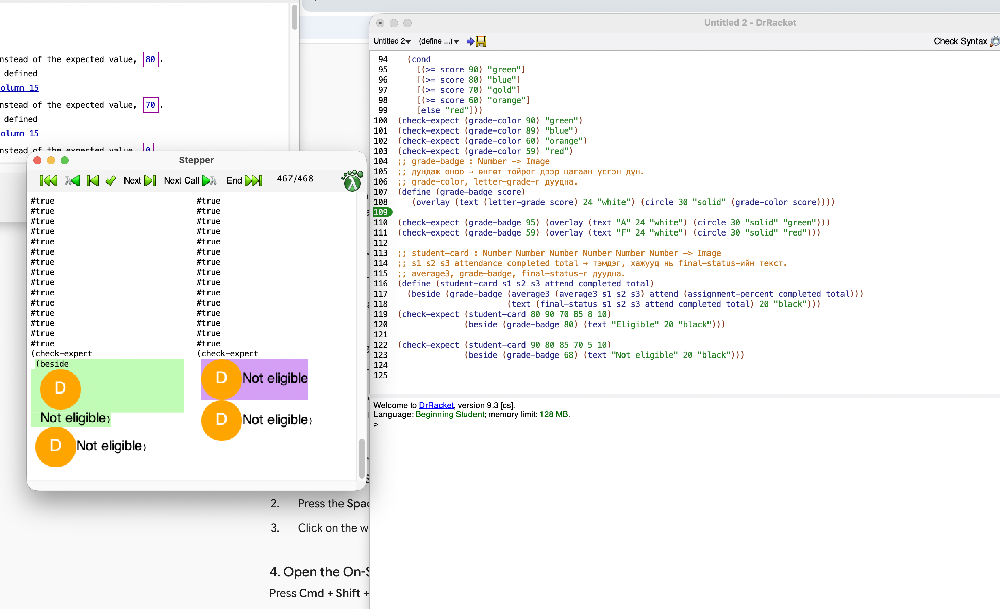

(eligible? 70 70 70 100 9 10)
; (passing-average? 70 70 70)   -> average3 = 70 -> #t
; (good-attendance? 100)        -> #t
; (assignments-complete? 9 10)  -> assignment-percent 90 -> #t
; (and #t #t #t)
; -> #t

(eligible? 90 80 85 70 5 10)
; (passing-average? 90 80 85)   -> average3 = 85 -> #t
; (good-attendance? 70)         -> #f
; and нэг #f олмогц зогсоно, assignments-complete? бодогдохгүй
; → #f
